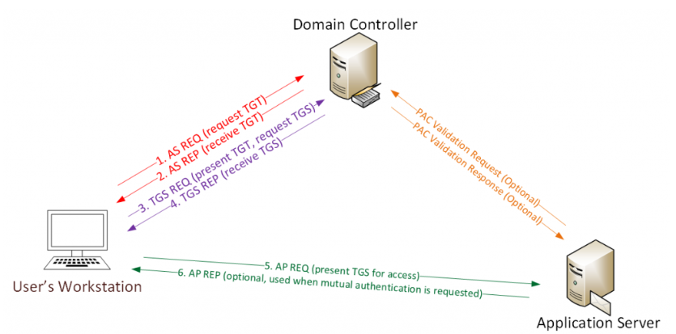
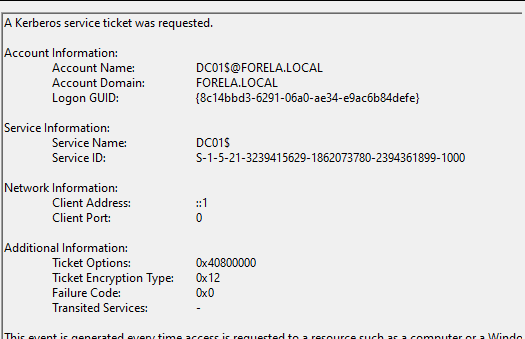
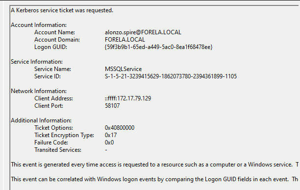
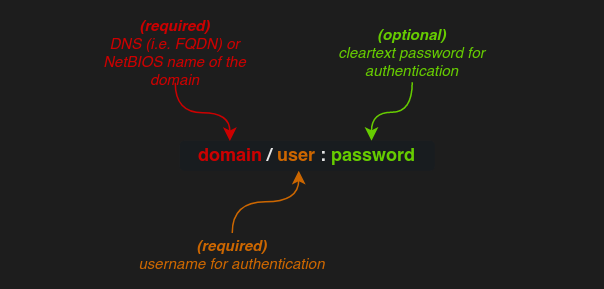
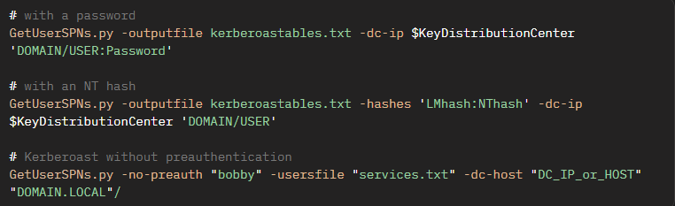
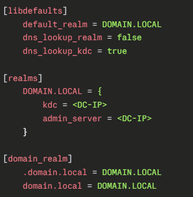
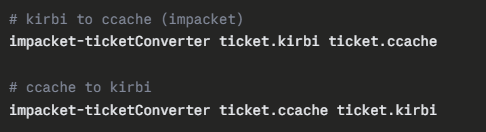

# Kerberoasting

## What is Kerberoasting

In short, **Kerberoasting** is a post-exploitation attack technique targeting the Kerberos authentication protocol, which enables hackers to extract encrypted service account credentials from AD (Active Directory).

The attack is performed by an authenticated domain user, who submits a request for a Kerberos ticket for a SPN (Service Principal Name). The retrieved Kerberos ticket is encrypted using a hash derived from the original password. Which the hacker can then use to perform an offline brute-force attack to attempt to attain the plaintext password of the service account. This would naturally lead to the ability to impersonate the account owner, and inherit access rights to any system, assets, or networks granted to the compromised account.



Lets quickly go over exactly how **Kerberos authentication** works before the attack.  
**1a.** Password converted to NTLM hash, a timestamp is encrypted with the hash and sent to the **KDC** as an authenticator in the authentication ticket (**TGT**) request (**AS-REQ**).  
**1b.** The **KDC** (Domain Controller) checks user information (logon restrictions, group membership, etc) & creates **TGT** (Ticket-Granting Ticket).  
**2.** The TGT is encrypted, signed, & delivered to the user (**AS-REP**). *Only the Kerberos service (**KRBTGT**) in the domain can open and read **TGT** data.*  
**3.** The User presents the **TGT** to the **DC** when requesting a **TGS** (Ticket Granting Service) ticket (**TGS-REQ**). The **DC** opens the **TGT** & validates **PAC** checksum – If the DC can open the ticket & the checksum check out, **TGT** = valid. The data in the **TGT** is effectively copied to create the **TGS** ticket.  
**4.** The **TGS** is encrypted using the target service accounts’ **NTLM** password hash and sent to the user (**TGS-REP**).  
**5.** The user connects to the server hosting the service on the appropriate port & presents the **TGS** (**AP-REQ**). The service opens the **TGS** ticket using its **NTLM** password hash.  
**6.** If mutual authentication is required by the client (think MS15-011: the Group Policy patch from February that added UNC hardening). Unless **PAC** validation is required (rare), the service accepts all data in the **TGS** ticket with no communication to the **DC**.

## Detecting & Mitigating Kerberoasting

[\<MitreAttack\> M1041,](https://attack.mitre.org/mitigations/M1041) [M1027,](https://attack.mitre.org/mitigations/M1027) [M1026,](https://attack.mitre.org/mitigations/M1026) [DET0157](https://attack.mitre.org/detectionstrategies/DET0157)  
Kerberoasting attacks are difficult to detect as it is exploiting a design limited of the Kerberos protocol itself, and how it is designed to work. In addition to this, traditional anti-virus solutions are incapable of detecting the attack because there is no reliance of malware. Although **identity-based threat detection solutions** and **EDR** (Endpoint Detection & Response) tools can help us identify unusual ticket requests.  
**1. Develop and deploy a comprehensive identity security strategy and toolset**  
[\<MitreAttack\> M1041,](https://attack.mitre.org/mitigations/M1041) [M1027,](https://attack.mitre.org/mitigations/M1027) [M1026](https://attack.mitre.org/mitigations/M1026)  
Identity security is a comprehensive solution that protects all types of identities within the enterprise – Human or machine, on-prem or hybrid, regular or privileged – to detect and prevent identity-driven breaches, especially when adversaries manage to bypass endpoint security measures. As part of the identity strategy, organizations should: **i. Ensure strong password hygiene** – This means complex, random and regularly updated passwords, reducing the window of opportunity for attackers as these factors greatly increase the time required to crack passwords offline – All service accounts should have “This account supports Kerberos AES 128/256 bit encryption.” enabled, further increasing the time it will take to crack the password.  
**ii. Principle of least privilege** – Identify which service accounts are the most vulnerable as they will grant attackers the highest levels of access and ensure SPNs are removed from human accounts: this can inadvertently expose them to Kerberoasting attacks. SPNs are sometimes assigned to user accounts when admins or devs install services, either manually or automatically during software setup. This is the practice that leaves accounts unnecessarily vulnerable... Instead, use dedicated service accounts or Group Managed Service Accounts (**gMSAs**) to reduce risk  
**iii. Require multi-factor authentication (MFA)** – I am a strong believer that MFA is mandatory in all areas of the modern world, providing an additional layer of security.  
**iv. Integrate the identity security solution** – your identity security shouldn’t be sat in isolation, rather integrate it with the rest of your infrastructure, your IAM system, EntraID, Okta, or on-prem AD. This way should it detect a risky authentication attempt, it will be able to automatically do something about it, block the user, revoke a session, etc... your MFA solution, this way risk-based decisions can trigger additional verification should a login from an unknown or unusual location with the compromised credentials. And zero-trust architecture meaning we don’t want to trust anything by default even when it comes from inside the network.

## 2. Detecting Kerberoasting Attempts

[\<MitreAttack\> DET0157](https://attack.mitre.org/detectionstrategies/DET0157)  
Detecting kerberoasting attempts requires monitoring for anomalous Kerberos TGS requests (Event ID 4769) with RC4 encryption (etype 0x17), accounts requesting an unusual number of service tickets in a short period, or service accounts targeted outside normal usage baselines may also correlate to suspicious process activity (e.g., Mimikatz invoking LSASS access).

## Event ID 4769

Anytime 4769 is fired, that’s a TGS request, including legitimate ones so the raw event data can be incredibly loud. In our example below we see a legitimate looking TGT request, by looking under ‘Additional Information’ we see ‘Ticket Encryption Type’ set to ‘0x12’. We would expect most legitimate Kerberos TGT operations to use either 0x12 or 0x11 (AES encryption) - this isn’t to say we can blind trust requests with 0x12 or 0x11 but it is worth knowing that all major open-source tools, like Impacket and Rubeus, request tickets in RC4 encryption type.



A meaningful way to reduce the amount of noise you’re dealing with, would be to filter requests from service names ending with ‘\$’ – these are computer accounts.

1.  Computer account passwords should be long (120 characters), randomly generated and rotated automatically (every 30 days by default).

2.  This makes them **effectively** uncrackable.

3.  So even if you did get a TGS encrypted with the machine account hash, good luck cracking it and having any realistic attack path.

It is also meaningful to check the account name the request is coming from, ensuring it is from a normal domain user account, this should be assured with the filter explained above – Lets reiterate what we are checking for now.

1.  Account name that is **NOT** a service or machine account (ending in \$)

2.  Service names that do **NOT** end with \$.

3.  Ticket encryption type will be 0x17 which is RC4 encryption allowing attacks to easily crack the hash – remember this isn’t a catch all.



Above we can see what is a perfect example of a kerberoasting event –  
Account Name: <alonzo.spire@FORELA.LOCAL>  
Service Name: MSSQLService  
Ticket Encryption Type: 0x17

## Volume-based detection

I mentioned earlier that the encryption type of a TGS-REQ request is not a catch all, this is because some legacy applications may only support 0x17 – so in these cases we may have to rely on other forms of detection like volume-based detection.  
Making 10 requests in a minute is unlikely to be an attack. But we can determine what our baseline activity is based on our environment, an attacker running Impacket-GetUserSPN.py against a domain with say 35 service accounts would generate 35 TGS requests in a matter of seconds. That is certainly an anomaly that’s detectable even if the etype is AES.

## LSASS Detection

So Event ID 4769 is not the only type of kerberoasting that can occur, that only applies to kerberoasting over the network – if an attacker were to already have access to a machine already and decides to use a tool like Rubeus.exe or Mimikatz.exe to perform the attack.  
In this case we may want to look for EventCode 10 ([Process Access (DC0035))](https://attack.mitre.org/datacomponents/DC0035) or/and EventCode 4624, 4648 ([Logon Session Creation (DC0067)](https://attack.mitre.org/datacomponents/DC0067)).

## Sysmon Event ID 10

[\<MitreAttack\> DC0035](https://attack.mitre.org/datacomponents/DC0035)

When this event ID is fired one process opens a handle to another. If you see a non-standard process (PowerShell, a renamed exe, anything that isn’t a known security tool) opening a handle to lsass.exe with access rights like 0x1410 or 0x1010 – These are the rights needed to read memory – This is a strong indication of credential access tooling. If we use Sysmon we can get the source process name, path, and the specific access rights requested which lets us differentiae a legitimate anti-virus scan from Mimikatz.

## Windows Security Event ID 4656 / 4663

[\<MitreAttack\> DC0067](https://attack.mitre.org/datacomponents/DC0067)

When this event ID is fired a process has requested or uses a handle to a secured object. It requires object access auditing to be enabled – which isn’t enabled by default most often. But can be a helpful secondary data source if Sysmon isn’t deployed. If we see access to some specific files like, NTDS.dit, SAM hive, SYSTEM hive or specific registry keys used in credential theft, then monitoring this event is certainly a solid indicator.

## The Attacker Perspective

## Impacket

[\<MitreAttack\> S0357](https://attack.mitre.org/software/S0357)

All the attacker needs to start this kind of attack would be a valid domain login as mentioned earlier in this document, we will start by going over how the attack is performed over the network, then later locally.  
The primary tool I am going to be analysing is Impackets, GetUserSPNs.py, so naturally this is not going to be an exhaustive guide to performing the attack.



Above are the required arguments to successfully authentication to Kerberos, and request a TGT and the following are some valid optional arguments you will frequently use as the attacker.

## Authentication Methods –

**-hashes**: *the LM and/or NT hash to use for a (NTLM). The format is as follows: \[LMhash\]:NThash (the LM hash is optional; the NT hash must be prepended with a colon (:). If an attack is using this flag, it would suggest they have already compromised something to attain the hash.*

**-aesKey**: *the AES128 or AES256 hexadecimal long-term key to use for a authentication (Kerberos).*

**-k**: *this flag must be set when authenticating **using Kerberos**. The utility will try to grab credentials from a Ccache file which path must be set in the KRB5CCNAME environment variable. In this case, the utility will do. If valid credentials cannot be found or if the KRB5CCNAME variable is not or wrongly set, the utility will use the password specified in the positional argument for plaintext Kerberos authentication, or the NT hash (i.e. RC4 long-term key) in the -hashes argument for . A Kirbi file could also be converted to a Ccache file using in order to be used by the utility (indirect). This option suggests you already have a Kerberos ticket so likely to be used while trying to pivot around to gain higher privileges.*

**-no-pass**: *this flag must be set when an empty password will by used, or no password at all. Without this flag, the user will be prompted for a password when running the utility. This flag is especially useful when using –k so no password ever touches the wire.*

**-no-preauth**: this option can be used to indicate a user vulnerable to ASREProast, to conduct an Kerberoast without preauthentication attack. This means **no valid credentials are required!**

## Targeting Methods –

**-dc-ip**: *IP address of the domain controller. If omitted, the positional argument's domain part will be used (in that case, it must be a Fully-Qualified-Domain-Name (FQDN)).*

**-usersfile**: a file with usernames to test. One username per line must be specified (just the username, no domain needed).

**-target-domain**: allows to specify the domain of the targeted user accounts. It is useful if these accounts are in another domain or forest and the attack is run across a trust. If omitted, the domain specified in the positional argument will be used.

## Output Methods –

**-debug**: *with this flag set, the utility will be more verbose and will possibly print useful information for debug purposes. With this flag set, the utility will also print tracebacks.*

**-ts**: *with this flag set, the utility will prepend all output with a timestamp.*

**-outputfile**: the file name to write the retrieved hashed values in. Without this option set, the values will be printed.

## Behaviour Modifiers –

**-request**: the script will retrieve the crackable hash. Without this option, the script will just output vulnerable accounts by identifying the user accounts with an SPN, without actually requesting the TGS.

**-request-user**: requests a Service Ticket for the SPN associated to the specified user (just the username, no domain needed). This allows to target a single specific account instead of targetting a list of user, either obtained dynamically or supplied with the -usersfile option.

**-save**: saves the requested Service Ticket on the disk, in the .ccache format. Useful for Pass the cache attack. This option enables **-request** as well and is especially useful for PTT attacks and pivoting.



## Rubeus.exe

[\<MitreAttack\> S1071](https://attack.mitre.org/software/S1071)

Now we will cover some details on using Rubeus.exe as the attacker, Rubeus is a tool that can accomplished far more than Kerberoasting attacks but for now that is out of scope of this document. It is an .exe commonly flagged by anti-virus solutions complicating the process for us as attackers. I would highly suggest reviewing <https://github.com/GhostPack/Rubeus>  
for details on the application, and a non-compiled version that you can work on obfuscating.  
And <https://github.com/GhostPack/Rubeus#kerberoast> will provide much greater detail and clarity that I believe I would be able to replicate here. I will however cover some common flags and things to consider when using the tool.

## Authentication Methods

by default Rubeus will use the account that you are currently using  
**/creduser** and **/credpassword**: *allows Rubeus to run the kerberoast operation under a different user context than the current session. Useful when the attacker has obtained credentials for another account but is running from a session with different privileges.*

**/rc4opsec**: *instead of requesting RC4-encrypted tickets (the default, and the most detectable), this flag requests AES tickets instead. This is a deliberate opsec choice — it avoids the RC4 etype filter that most detection rules rely on. If an attacker is using this flag, they are aware of defensive monitoring and actively trying to evade it.*

**/aes**: *similar to above, explicitly requests AES256 encryption. Harder to detect, harder to crack offline — but some environments still have RC4 as a fallback which Rubeus will use if AES isn't available.*

## Targeting Methods

**/user**: *requests a service ticket only for the SPN associated with the specified account. Same principle as -request-user in Impacket — targets a single account rather than bulk-requesting all SPNs. A careful attacker will use this to avoid the volume spike that detection rules look for.*

**/domain**: *specifies the target domain. Useful when operating across a trust relationship, equivalent to -target-domain in Impacket.*

**/dc**: *specifies the domain controller to target by hostname or IP, equivalent to -dc-ip in Impacket.*

**/ldapfilter**: *allows the attacker to supply a custom LDAP filter to narrow which accounts are targeted. This gives fine-grained control over which SPNs are requested, useful for stealthy targeted attacks against specific high-value service accounts rather than noisy bulk enumeration.*

## Output Methods

**/outfile**: *writes the retrieved hashes to a specified file rather than printing to screen, equivalent to -outputfile in Impacket.*

**/nowrap**: *by default Rubeus wraps long hash output across multiple lines, which breaks hashcat input formatting. This flag outputs hashes on a single line, ready to feed directly into hashcat or John without manual cleanup.*

## Behaviour Modifiers

**/format**: *specifies the output hash format — hashcat or john. Rubeus will format the extracted ticket hash to match whichever cracking tool the attacker intends to use. Default is hashcat format.*

**/simple**: *outputs only the hashes with no additional information. Useful when piping output directly into a cracking workflow.*

**/stats**: *rather than requesting tickets, this flag enumerates Kerberoastable accounts and prints statistics about them — encryption types supported, password last set dates, and whether accounts are enabled. No TGS requests are made, meaning this leaves a much smaller footprint. An attacker uses this for reconnaissance before deciding which accounts to actually target.*

**/pwdsetbefore** and **/pwdsetafter**: *filters targets by password last set date. An attacker specifically targeting accounts whose passwords haven't been changed in years — far more likely to be weak or default — would use these flags to narrow the target list before making any TGS requests.*

## A note on opsec differences from Impacket

Worth stating explicitly: a careful attacker using Rubeus will combine /rc4opsec, /user, and /stats to perform a low-noise targeted attack — enumerate first with no ticket requests, identify the highest value account with the oldest password, then request a single AES ticket for that one account. That generates one 4769 event with an expected etype. Compare that to the default bulk Impacket run which generates dozens of RC4 4769 events in seconds — the detection difficulty is meaningfully different between the two approaches.

## Important Scripts/Wrappers

## Faketime

Often when using impacket and interacting with Kerberos in generate, you will receive a time skew error and need to use a work-around to keep it happy. This is because Kerberos is highly sensitive to clock sync between machines – by default this is a maximum of 5minutes of time skew, between you/client and the DC. This is deliberate to help protect it against replay attacks.  
We will see this error – **KRB_AP_ERR_SKEW**  
For this reason when attack from a Linux machine we will use my choice of work-around faketime as a wrapper for any commands we send to Kerberos, or any tools we use with Kerberos authentication.

## *sudo apt install faketime*

```bash
faketime "\$(ntpdate -q \<DC-IP\> \| awk '{print \$1, \$2}' \| head -1)" python3 GetUserSPNs.py domain.local/user:password -dc-ip \<DC-IP\> -request
```

## Using Kerberos Tickets on Linux

When we want to use a Kerberos ticket on Linux there are some dependencies we need and setup options before we can successfully interact with it, the main ones being **krb5-user** & **config**.

## *sudo apt install krb5-user krb5-config libkrb5-dev*

During the install it will ask for the domain name and dc-ip / kdc which we should provide in order for it to work correctly below is an example of what the /etc/krb5.conf looks like, without this being setup correctly even a valid ticket is going to fail.



## KRB5CCNAME Environment Variable

This variable is what tells Kerberos-aware tools like evil-winrm, impacket, and generally anything that supports Kerberos authentication where to find the ticket cache – it is what is pointing them to the .ccache file of our stolen ticket.

## *export KRB5CCNAME=/path/to/ticket.ccache*

Often times we will have to convert .kirbi files from Rubeus to .ccache files so we can make use of it. We can do this with a cool called impacket-ticketConverter



And lastly we can confirm the ticket is valid with `klist` this will list all tickets we currently have cached and their expiry times, in the event it comes back empty or errors, our **KRB5CCNAME** is not set correctly, so doing this as a sanity check is always worthwhile and faster than assuming it's the tool that is failing us first.

## References:

<https://attack.mitre.org/>

<https://www.hackthebox.com/blog/kerberoasting-attack-detection>

<https://github.com/GhostPack/Rubeus>

<https://github.com/fortra/impacket>

<https://www.crowdstrike.com/en-gb/cybersecurity-101/cyberattacks/kerberoasting/>

<https://adsecurity.org/?p=3458>

<https://specterops.io/blog/2019/02/20/kerberoasting-revisited/#8fa1>

<https://pypi.org/project/faketime/>
